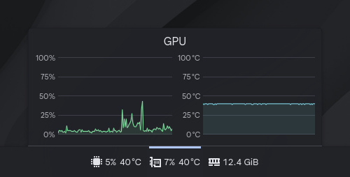

# Text with Icon Sensor Face

Compact, yet highly configurable sensor face for KDE Plasma's System Monitor, ideal for thin horizontal panels



## Features

- **Flexible layout:** Display sensor values, static text and icons in your desired order
- **Highly configurable:** Allows for advanced configuration of each item, with support for dynamic settings based on sensor values
- **Customizable Full Representation:** Display a different Sensor Face in Full Representation mode (e.g., line chart, bar chart)

## Requirements

- KDE Plasma 6
- System Monitor by Plasma Development Team

## Installation

> [!NOTE]
> This Sensor Face is not yet available on the KDE Store, but that might change in the future

1. Download the most recent release (`.zip` file) from [Releases](https://github.com/PatrickSzela/libksysguard-texticon/releases)
2. Place the contents of the downloaded release under `~/.local/share/ksysguard/sensorfaces/` (create if missing)

## Usage

1. Add a System Monitor widget to your desktop or a panel
2. Under _Appearance_ tab, set _Display style_ to `Text with Icon`
3. Add your desired sensors under _Sensors Details_ tab to the _Sensors_ list
4. By default, the widget will display the default configuration - set up your desired layout under _Text with Icon Details_ tab by adding items to the _Formatter_ field with the available buttons: _Icon_, _Sensor_ or _Text_

## Configuration

| Setting                      | Type        | Information                                                                               |
| ---------------------------- | ----------- | ----------------------------------------------------------------------------------------- |
| Spacing between items        | Integer     | Spacing between items in the _Formatter_ field, in pixels                                 |
| Configuration                | JSON Object | Object containing common configuration for each item in the _Formatter_ field             |
| Formatter                    | JSON Array  | Array of displayed items with their specific configurations (merged with _Configuration_) |
| Icon/Sensor/Text             | -           | Append a specified item to the _Formatter_ field                                          |
| Format                       | -           | Format the contents of the _Configuration_ and _Formatter_ fields                         |
| Display style                | String      | Sensor Face to display in a Full Representation mode                                      |
| Force Compact Representation | Boolean     | Whether to display the selected Sensor Face under _Display style_ in its compact form     |
| -                            | -           | Additional settings for Sensor Face selected under _Display style_, if applicable         |

### Supported Formatter items

#### Icon (`"type": "icon"`)

Displays an icon

##### Supported configuration fields

- `icon` - name of the icon (alias for `source`)
- `iconSize` - size of the icon, in pixels (alias for `width` and `height`), `16` by default
- More fields available on [Kirigami Icon QML Type API Reference](https://api.kde.org/qml-org-kde-kirigami-primitives-icon.html)

##### Example

```json
{
  "type": "icon",
  "icon": "cpu-symbolic"
}
```

#### Sensor (`"type": "sensor"`)

Displays the formatted value of a sensor

##### Supported configuration fields

- `sensorIndex` - index of the sensor in the _Sensors_ list, will be automatically assigned if not specified
- `sensorId` - path of the sensor to display (it's preferable to use `sensorIndex` instead)
- `precision` - number of digits to display after the decimal point, `1` by default
- More fields available on [Label QML Type Documentation](https://doc.qt.io/qt-6/qml-qtquick-controls-label.html)

##### Example

```json
{
  "type": "sensor",
  "sensorIndex": 0
}
```

#### Text (`"type": "text"`)

Displays the specified text

##### Supported configuration fields

- `text` - text to display
- More fields available on [Label QML Type Documentation](https://doc.qt.io/qt-6/qml-qtquick-controls-label.html)

##### Example

```json
{
  "type": "text",
  "text": "Temperature:"
}
```

It is also possible to insert a text or number value directly into the _Formatter_ array, without the need of creating an entire object:

```json
[
  "Temperature:",
  {
    "type": "sensor"
  }
]
```

### Callbacks

> [!WARNING]
> Be careful when using callbacks, especially if you do not understand what the code does. Executing JavaScript from a string is a significant security risk.

The value of each field in _Formatter_ and _Configuration_ can be changed dynamically by setting its value to a string containing a JavaScript function. The following parameters are passed to these functions:

1. `sensor` - object containing data about current sensor (applies only for sensors (`"type": "sensor"`), for other types this value will be `null`) - see [Sensor Class Reference](https://api.kde.org/legacy/plasma/libksysguard/html/classKSysGuard_1_1Sensor.html) for more information
2. `sensors` - array with data about all sensors in the _Sensors_ list
3. `config` - configuration of the current item
4. `kirigami` - Kirigami namespace, used to access data such as current color scheme - see [Kirigami API Reference](https://api.kde.org/kirigami-index.html) for more information

It is recommended to use an external tool with JavaScript syntax highlighting support (e.g., [Visual Studio Code](https://code.visualstudio.com/) or [Visual Studio Code for the Web](https://vscode.dev/)) to write these callbacks. Additionally, for easier debugging, create your desired configuration in a System Monitor (`plasma-systemmonitor`) started from a terminal first, before copying these settings to a widget placed on a panel or the desktop.

> [!NOTE]
> Please remember, that JSON doesn't support multiline strings - the entire function must be condensed to one line

#### Examples

##### _Formatter:_ Change sensor's color based on its value

This example changes the color of the sensor's value based on the following thresholds:

- if value is equal or bigger than `80`, the color will be the _Negative Text_ color from Plasma's color scheme
- otherwise, if value is equal or bigger than `60`, the color will be the _Neutral Text_ color from Plasma's color scheme
- otherwise, the color will be the default text color from Plasma's color scheme

Note the usage of the `precision` in the example - to match the displayed value with the thresholds above we need to manually round the value before comparing it to either of these thresholds

```json
[
  {
    "type": "sensor",
    "sensorIndex": 0,
    "color": "(s, _, c, k) => { const p = Math.pow(10, c.precision); const v = Math.round(s.value * p) / p; return v >= 80 ? k.Theme.negativeTextColor : v >= 60 ? k.Theme.neutralTextColor : k.Theme.textColor; }"
  }
]
```

##### _Configuration:_ Change color of every item depending on sensor's value

This example changes the color of every item (including icons) based on the same thresholds as in the example above, using the value of the first sensor in the _Sensors_ list.

Notice the difference in the order of the arguments in the function (`s` is now the 2nd argument) and how now we're referring to the 1st item in the array when retrieving the sensor's value (`s[0].value`)

```json
{
  "color": "(_, s, c, k) => { const p = Math.pow(10, c.precision); const v = Math.round(s[0].value * p) / p; return v >= 80 ? k.Theme.negativeTextColor : v >= 60 ? k.Theme.neutralTextColor : k.Theme.textColor; }"
}
```

## Uninstallation

1. Delete the Sensor Face under `~/.local/share/ksysguard/sensorfaces/`

## Building

1. Clone this repository
2. Install the required dependencies: `pnpm i`
3. Build and install the script: `pnpm run dev`

## Roadmap

- Add support for a two-dimensional grid layout
- Create proper configuration UI instead of editing raw JSON and callbacks in text areas
- Upload the Sensor Face to KDE Store
